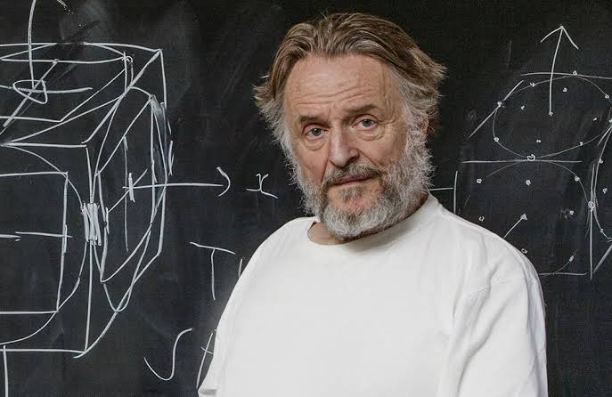

## Assignment Title: "The Game of Life: Exploring the Emergence of Complexity"

A tribute to John Horton Conway who died in 2020:

## Brief 

In this assignment, you will create a game that simulates the emergence of artificial life. The goal is to explore how simple rules and interactions between individual agents can give rise to complex and unpredictable behaviors at a system level.

To tie in the themes of John Conway, Alan Watts, Terence McKenna, Maths, and the Universe, you will be asked to incorporate the following elements:

Alan Watts: Consider how the concept of "wu-wei" (effortless action) can be applied to the behavior of the artificial life forms in your game. Can you create agents that exhibit emergent behaviors without needing to be explicitly programmed for them?

Terence McKenna: Use the concept of "novelty" to guide your approach to designing the rules and behaviors of the artificial life forms. How can you create a system that is always evolving and adapting to new challenges and opportunities?

Mathematics: Explore how mathematical concepts like chaos theory, fractals, cellular automata and boids can be used to model the behavior of the artificial life forms. Consider how different mathematical models can lead to different emergent behaviors.

The Universe: Think about how the behavior of the artificial life forms in your game relates to larger patterns and structures in the natural world. How can you create a system that reflects the complexity and interconnectedness of the universe?

## Deliverables

A working game that simulates the emergence of artificial life. The engine should be able to generate a variety of different emergent behaviors depending on the initial conditions and rules.

A readme.md file in your git repo that describes your approach to designing the game and explores the themes of John Conway, Alan Watts, Terence McKenna, Mathematics, and the universe. The report should include examples of emergent behaviors generated by the engine and an analysis of how they relate to the larger themes.

A demo video that showcases the game in action and highlights some of the emergent behaviors that it can generate.

## Marking Scheme:

Visuals:

0-10 points: The quality of the visual design of the game, including the aesthetics, clarity, and coherence of the visual elements. Higher marks will be awarded for game engines with well-designed graphics that complement and enhance the emergent behaviors of the artificial life forms.

Complexity:

0-20 points: The degree of complexity and sophistication of the emergent behaviors generated by the game engine. Higher marks will be awarded for game engines that produce a wide range of interesting and surprising behaviors, and that demonstrate a deep understanding of the mathematical and computational principles underlying emergent systems.

Novelty:

0-15 points: The degree of novelty and originality in the design of the game engine. Higher marks will be awarded for games that explore new and innovative approaches to simulating artificial life, and that demonstrate a creative use of the themes of Alan Watts, Terrence McKenna, Mathematics, and the universe.

Anthropomorphic qualities:

0-15 points: The degree to which the artificial life forms exhibit anthropomorphic qualities, such as the ability to learn, adapt, and communicate. Higher marks will be awarded for game engines that create artificial life forms that are complex, diverse, and capable of interacting with their environment in interesting and creative ways. Also higher marks will be awarded for life forms that evoke an emotional connection with the player - be it empathy, awe, compassion, love. 

Overall quality:

0-40 points: An overall assessment of the quality of the game engine, taking into account all of the above criteria. This score will reflect the degree to which the game engine successfully explores the themes of the assignment and creates a compelling and engaging simulation of artificial life.

Total: 0-100 points.